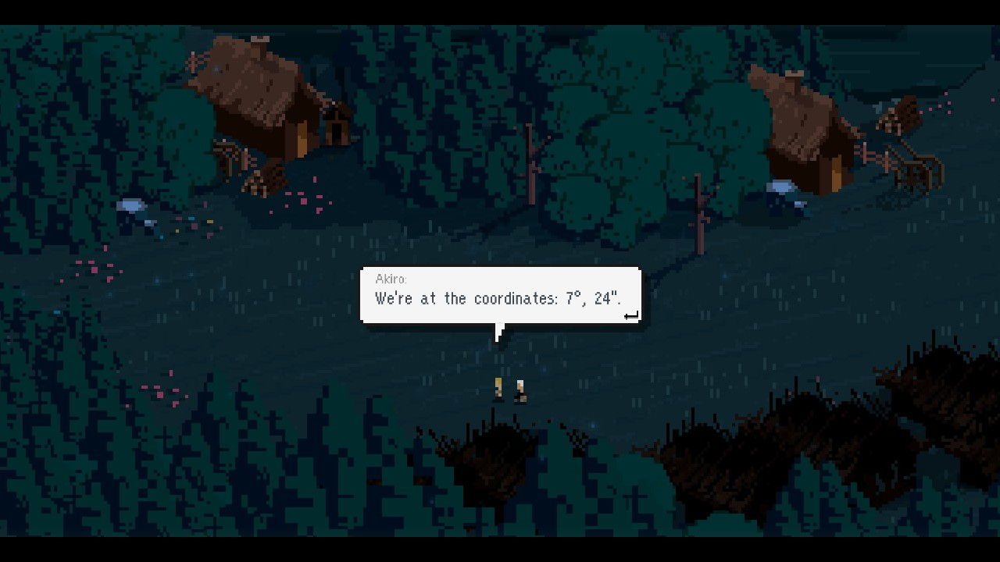

The developers hid a motorcycle at coordinates 7o 24". ^[ Walk all the way left at the west bridge to meet the developers. ]

# How to find coordinates?
You would need *a navigation tool*. ^[ There is a compass in Sauerkraut's wardrobe. ]

# I have it
Great. Now, when you use the compass you can see your current coordinates.

# How do they work
The first number increases when you go from left to right. The second number increases when you go from up to bottom.

# Okay?
So, 24" means it is quite far down...

# And?
7o means it is quite in the middle...

# Show me the place!
It is below the cabins, between the two of them. You have to look at the compass. You can now access the secret location.

