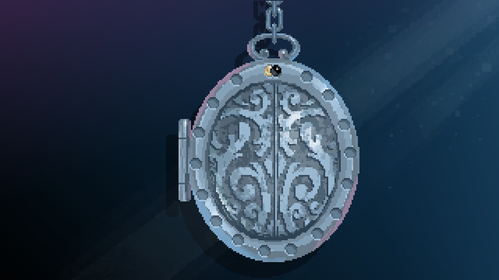

The ashes are buried somewhere in the caves. You don't have to get into the tunnels!

# Where then?
Search around. Use Krakovitz sensing power. ^[ You should find a spot in the ground left of the chairs. ]

# I found it!
Dig it up. ^[ There is a rusty shovel near the fish pond. ]

# I found it!
It is a chest. Open it to get the ashes.

# How?
You need an old key.

# Where is it?
You have been carrying it with you for a long time, already.

# You mean?
The locket. Open it. Let me show how: ^[  ]

# I got the key
Open the chest and grab the ashes.
