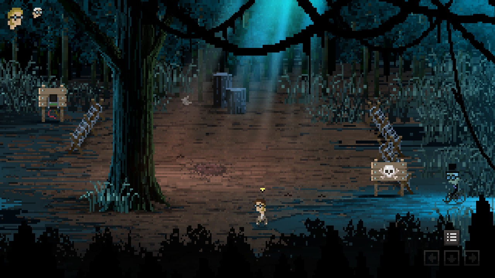

There is a mine field in the forest. Have you visited [the Eklipse Fest](/part-06/index.md), already?

# Yes
Okay, just checking.

# How to get past the minefield?
You tried to just, you know, walk over it?

# Yes!!
Okay okay... Maybe you could *fly* over it?

# Fly?
Or, float?

# Float?
Didn't the clown show a great stunt with his balloon?

# He did
But he is dead now. Could you get the balloon, though? ^[ Look at the legs in the feast area. ]

# The balloon is empty
Fill it with helium to do the tricks. ^[ There is helium at the submarine. Use the balloon on the tube. ]

# The balloon is filled
Great, now you can float with it over the mine field.

# I keep exploding!
Find the narrowest part of the mine field and float over there. Pull the lever to disable the mine field.

# Where?

